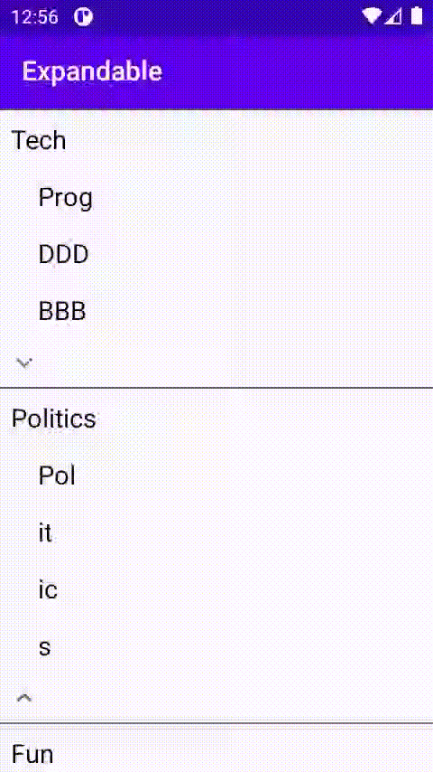

= Expander

A library that manage expandeable recycler in easy and beautiful way.

[source,kotlin]
.Activity.kt
----
 val items = ArrayList<ExpandableModel>()
        items.add(ExpandableModel(0, "Tech", PARENT))
        items.add(ExpandableModel(1, "Prog", CHILD))
        items.add(ExpandableModel(2, "DDD", CHILD))
        items.add(ExpandableModel(3, "BBB", CHILD))
        items.add(ExpandableModel(4, "CCC", CHILD))
        items.add(ExpandableModel(5, "TTT", CHILD))
        items.add(ExpandableModel(6, "TTT", CHILD))
        items.add(ExpandableModel(6, "vvvv", CHILD))
        items.add(ExpandableModel(11, "Politics", PARENT))
        items.add(ExpandableModel(12, "Pol", CHILD))
        items.add(ExpandableModel(13, "it", CHILD))
        items.add(ExpandableModel(14, "ic", CHILD))
        items.add(ExpandableModel(15, "s", CHILD))
        items.add(ExpandableModel(16, "Fun", PARENT))
        items.add(ExpandableModel(17, "Football", CHILD))
        items.add(ExpandableModel(18, "Basket", CHILD))
        items.add(ExpandableModel(122, "123", CHILD))
        items.add(ExpandableModel(19, "Fill", PARENT))
        items.add(ExpandableModel(20, "STY", PARENT))

recyclerView.adapter = ExpandableAdapter(this, items, this)
----

